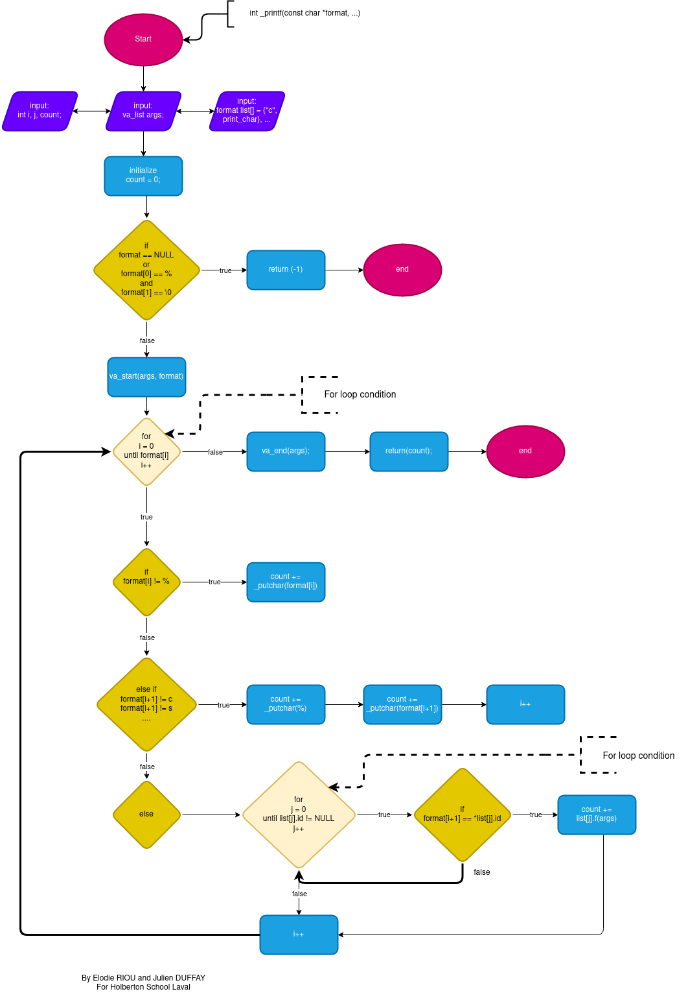

# Project 0x11. C - printf

## Background Context

It's a team project where we have to create the fuction printf !

Our team, my friend and me (Julien and Elodie, respectively):

## Tasks (mandatory)

#### 0. I'm not going anywhere. You can print that wherever you want to. I'm here and I'm a Spur for life.

Write a function that produces output according to a format.

* Prototype: `int _printf(const char *format, ...);`
* Returns: the number of characters printed (excluding the null byte used to end output to strings)
* write output to stdout, the standard output stream
* `format` is a character string. The format string is composed of zero or more directives. See man 3 printf for more detail. You need to handle the following conversion specifiers:
  * `c`
  * `s`
  * `%`
* You don’t have to reproduce the buffer handling of the C library printf function
* You don’t have to handle the flag characters
* You don’t have to handle field width
* You don’t have to handle precision
* You don’t have to handle the length modifiers

#### 1. Education is when you read the fine print. Experience is what you get if you don't

Handle the following conversion specifiers:
* `d`
* `i`
* You don’t have to handle the flag characters
* You don’t have to handle field width
* You don’t have to handle precision
* You don’t have to handle the length modifiers

#### 2. Just because it's in print doesn't mean it's the gospel

Create a man page for your function.

# Function _printf

## Description

The function printf is a collection of files.c that when compiled and executed, produces output according to a format.

## Prototype

`int _printf(const char *format, ...);`

## Format Specifier

| Specifier | Description
| --- | --- |
| `%c` | print a single *c*haracter |
| `%s` | print a *s*tring of characters |
| `%%` | print a percent sign (*\%* also works) |
| `%d` | print a *d*ecimal (base 10) number |
| `%i` | print an *i*nteger in base 10 |

## How to do

Make some flowharts like pseudo-code before coding. This is to clarify what we want to do.

## How to use

* include `main.h`
* `printf_conversion.c` contain functions conversion specifier
* `_printf.c` function that passing a formatted string with any format specifiers
* `_putchar.c` function that gets a char parameter with the stdout, the standard output stream

###

## Requirements

* Compile command: `gcc -Wall -Werror -Wextra -pedantic -std=gnu89 *.c`
* A `test` folder containing all tests files including `main` functions
* Use `Structures` and `Function pointers`
* Header file should be include guarded
* Prototypes should be included in header file
* Not more than 5 functions per file

## Examples outputs

* `_printf("%c", 'H');` => __prints the character "H"__
* `_printf("%s\n", "Holberton School");` => __prints the string "Holberton School" followed by a new line__
* `_printf("%%");` => __prints the character "%"__
* `_printf("%d", 7896576321345);` => __prints the decimal "7896576321345"__
* `_printf("%i", 29);` => __prints the integer "29"__

## Writing man pages

The `groff` is a particular text-formatting language. Groff provides several macro packages:

| Macro | Meaning |
| --- | --- |
| \fB | bold |
| \fI | italic |
| \fR | roman type |
| .SH | start a section |
| .SS | start subsection |
| .TP | request the line after |

Almost all Unix man pages use the section progression : NAME, SYNOPSIS, DESCRIPTION, FILE, SEE ALSO, NOTES, AUTHOR, and BUGS.

In order to format a man page and view it on the terminal, use the command: `groff -Tascii -man [name man].man | more`

To know more about groff, go to the `groff_man`

## Authors

* Julien DUFFAY
  * [LinkedIn](https://www.linkedin.com/in/julien-duffay-206822a5/)
  * [Github](https://github.com/julien3641)

* Elodie RIOU
  * [LinkedIn](https://www.linkedin.com/in/%C3%A9lodie-riou-41a43aa8/)
  * [Github](https://github.com/elodieriou)
